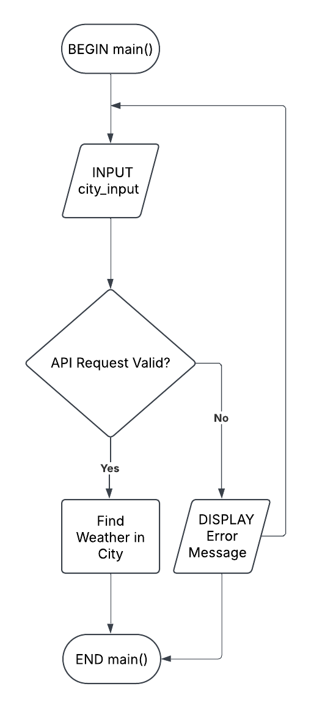
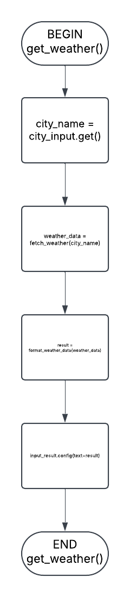
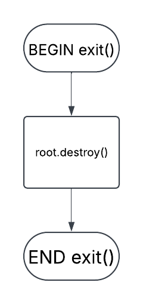
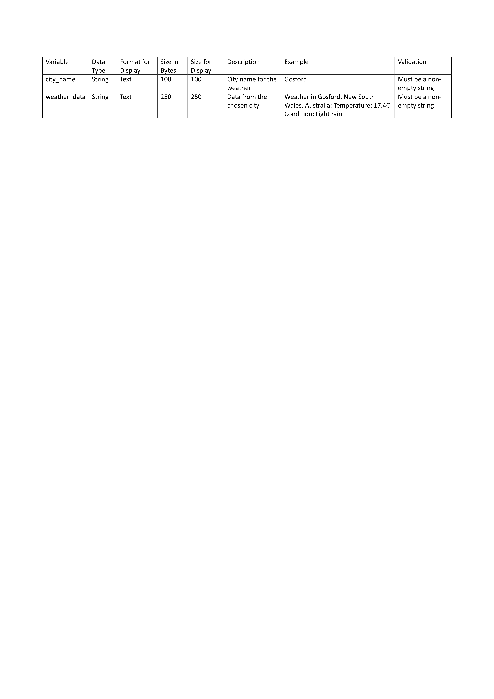

# **11SE Task 1 2025 - Weather Application**
## Designed and Documented by Alex Wu
This is where all the documentation and development will occur.

# Requirements Definition
## Functional Requirements
- **Data Retrieval:** What does the user need to be able to view in the system? 

The user must view the data that is obtained from the dataset. If there are any errors due to not having any data or something else, it will need to specify if there isn't any data or not. For example, if a movie in a dataset did not have the time of release, then it should say something like N/A, and not an error so the user knows the information is unavailable.

- **User Interface:** What is required for the user to interact with the system?

For the user to interact with the system, the requirement will need to be at least a command-line interface which allows the user to understand what is happening, and use the application to connect with the API without any bugs or problems.

- **Data Display:** What information does the user need to obtain from the system?

The user needs to be able to access the data from the chosen API. There cannot be any modifications of the dataset, and errors need to be shown if something bad happens.

## Non-Functional Requirements
- **Performance:** How well does the system need to perform? 

The system needs to be fairly efficient as it cannot be too slow and perform the sorting slowly. This isn't really hard as python is a fairly fast programming language, and with the help of other modules, it won't be noticeably slow unless there is a lot of data to sort through.

- **Reliability:** How reliable does the system and data need to be?

To have a reliable program, there needs to be a well-written application that has no bugs and can be used without breaking. There also needs to be a well chosen API, as an unreliable and inaccurate API will result in a lot of errors and bugs. Preferably, the API can be chosen from https://github.com/public-apis/public-apis, as it includes a list of good public APIs that can be used for different applications.

- **Usability and Accessibility:** How easy to navigate does the system need to be? What instructions will we need for users to access the system?

There should be a README file where users can open it and get instructions on how to use the application, how to install the required repositories, etc. There should also be comments on the code to let people understand it. If wanted, a GUI could be made for a better looking program, but may be advanced to implement.

# Determining Specifications
## Functional Specifications
- **User Requirements**

The user needs to be able to view the data from the API. There will be an input, where the user can enter whatever city they like. If the data matches, it will display the weather info, and if it doesn't, it will return an error.

- **Inputs & Outputs**

It needs to accept the input city from the user and out the weather conditions in that city, including the temperature and condition.

- **Core Features**

The program must communicate with the API and get data from the city that the user has chosen.

- **User Interaction**

The program will be a fairly simple application, in which it will provide the data for the user from an input where the user can write their chosen city.

- **Error Handling**

The most common error will probably be when the data isn't found, it could be due to the API not having that data or the user entering the incorrect details. This could be handled with a prompt saying "You may have entered the incorrect prompt or the API does not have this data. Please try again.", which handles the error well and lets the user know something wrong happened.

## Non-Functional Specifications
- **Performance**

The system will need to be able to run calculations within the API efficiently, so the user does not have to wait for it for a long time. 

- **Useability / Accessibility**

To make the program more usable and accessible, there could be new features added for those who need extra help such as an accessibility option.

- **Reliability**

There won't be many program-breaking bugs or issues, as all it is programmed to do is just to fetch the data from the API based on the user's input and then displaying it. The data won't be a problem as it is just the weather, and duplicate data won't be happening in a weather program, as the old data is removed as new data is updated.

## Use Cases
- **Actor:**

User (Someone wanting to know what the weather's like in a certain city.)

- **Preconditions:** 

Internet access; API with weather data.

- **Main Flow:**

1. **Enter City:** - Users input a city that they want to know what the weather is.

2. **API Communication:** – Program tells the API to retrieve the data from the specified city, which it then returns with data, or an error.

3. **Output Display:** – System displays the data, if there is an error, it will tell them.

4. **New City:** – If the user enters another city with the same input, the program will repeat the steps.

- **Postconditions:** - Weather data is retrieved successfully or is returned an error.

# Design
## Gantt Chart


## Structure Chart
### Main Process


## Algorithms
### Main Process


#### Psuedocode
```
BEGIN root.mainloop()
INPUT city_input
IF API Request Valid THEN
    Find Weather in City
ELSE
    DISPLAY "There was an error retrieving your data from the city."    
ENDIF
END root.mainloop()
```

### get_weather


#### Psuedocode
```
BEGIN get_weather()
    city_name = city_input.get()
    weather_data = fetch_weather(city_name)
    result = format_weather_data(weather_data)
    input_result.config(text=result)
END get_weather
```

### exit


#### Psuedocode
```
BEGIN exit()
    root.destroy()
END exit()
```

## Data Dictionary


# Development
**main.py**
```
"""
Import needed modules
"""
import tkinter as tk
import ttkbootstrap
from api import *

"""
Fetches the weather from the other python file and displays it
"""
def get_weather(event=None):
    city_name = city_input.get()
    weather_data = fetch_weather(city_name)
    result = format_weather_data(weather_data)
    input_result.config(text=result)

"""
Closes the program
"""
def exit():
    root.destroy()
  
"""
Creates the main window
"""
root = ttkbootstrap.Window(themename="superhero")
root.title("11SE Weather API")
root.minsize(300, 350)
root.maxsize(300, 350)
root.geometry("300x350")

"""
Adds the title of the program
"""
title = ttkbootstrap.Label(
    text="AlxWeather",
    font=("Helvetica", 20, "bold"),
    bootstyle = "primary",
    wraplength=250
)
title.pack(pady=5)

"""
Adds the instructions
"""
instructions = ttkbootstrap.Label(
    text="Enter a city for the weather:", 
    font=("Helvetica", 14,),
    bootstyle = "info",
    wraplength=250
)
instructions.pack(pady=5)

"""
Adds a text box for city input
"""
city_input = ttkbootstrap.Entry(
    font=("Helvetica, 16")
)
city_input.pack(pady=10)

"""
Binds the enter key to the get_weather function
"""
city_input.bind("<Return>", get_weather)

"""
Adds a button the submit the city
"""
submit_input = ttkbootstrap.Button(
    text="Search",  
    command=get_weather,
    bootstyle="outline button"
)
submit_input.pack()

"""
Displays the weather info after submitted
"""
input_result = ttkbootstrap.Label(  
    font=("Helvetica", 12),
    bootstyle="success",
    wraplength=250
)
input_result.pack(pady=25)

"""
Exits the program when pressed
"""
exit_button =ttkbootstrap.Button(
    text="Exit Program",
    command=exit,
    bootstyle="danger"
)
exit_button.pack(pady=10, side="bottom")

"""
Loops the program until closed
"""
root.mainloop()
```

**api.py**
```
"""
Import needed modules
"""
import requests

"""
# API key and url
"""
api_key = "63c9ea7502f74f61a0233952251103"
base_url = "http://api.weatherapi.com/v1"

"""
Gets the information from the API using the variables
"""
def fetch_weather(city_name):
    complete_url = f"{base_url}/current.json?key={api_key}&q={city_name}"
    response = requests.get(complete_url)
    if response.status_code == 200:
        return response.json() # If successful (code 200), returns the response
    else:
        return None # If not, doesn't do anything

"""
Formats the given data
"""
def format_weather_data(weather_data):
    if weather_data:
        location = weather_data["location"]["name"]
        region = weather_data["location"]["region"]
        country = weather_data["location"]["country"]
        temperature = weather_data["current"]["temp_c"]
        condition = weather_data["current"]["condition"]["text"]
        return (f"Weather in {location}, {region}, {country}:\n"
                f"Temperature: {temperature}°C\nCondition: {condition}") # Returns the formatted data
    else:
        return "There was an error retrieving your data from the city." # If it cannot format, it will display this
    
```

# Integration
```
from api import *
```

# Testing and Debugging
## GitHub Commit Rewrites
Please keep in mind that these are only rewrites of the programming, commits with both will not have the documentation included.

### Done, Mar 10
Improvements to project development and made a basic GUI. Everything is working, nothing wrong. Hopefully there will be more development done on the GUI and possible adding the API feature in.

### Work, Mar 11
Configured the GUI more and added the API in my_module. One of the problems is that there is no GUI input for the API, on console-based. Need to work on implementing that feature into the GUI.

### Work, Mar 17
Didn't do much, just changed some variables and names. Still needing to implement the GUI feature, also tried to add a RNG for a random weather display (e.g. Good morning, the weather in "x" is "y", different greetings). A bit hard to implement, hopefully there are more features added soon.

### Finished main.py and my_module.py, Mar 19
GUI feature added, with better GUI changes such as font, etc, and ditched the random feature. This is all working well, the API is very good now. For the future, there should be just some GUI improvements, as the main part is already done.

### GUI, Mar 21
Did some minor changes on the GUI, as well as adding the modules in requirements.txt. All is working well, no bugs. Not much else to do other than improvements.

### Work, Mar 24
Added a new module called ttkbootstrap, which is a very good-looking addon for Tkinter with custom themes, making it look good, as well as adding an enter input to submit the city. All is fine, did some configuring. Not much to do again.

### Work, Mar 27
Changed my_module.py to api.py, added ttkbootstrap in the requirements. Nothing wrong, basically almost done for the programming part.

### Work, Mar 31
Added an exit button, and changed some of the GUI sizing. All good, not much else to do.

# Installation
**requirements.txt**
```
ttkbootstrap >= 1.10.1
requests >= 2.32.3
```

**README.md**
```
# 11ASE_Task_1
This task is about developing a data science program, which can allow users to search for data from an API that they want to know about. please see PROJECT_DEVELOPMENT.md for more information.

# AlxWeather
AlxWeather is a lightweight GUI made in Tkinter that communicates with https://weatherapi.com's API to find weather in any available city.

## Installation
First, clone this repository and navigate to the root directory.

To install the required dependencies, install requirements.txt which can be done by opening a terminal/cmd window in the root folder and typing ``pip install -r requirements.txt``, which will automatically install all the things you will need to run the program. Make sure to check for updates constantly!

Regarding the API key, you may use the provided one, but if their API request limit runs out, you will need to get your own. To do this, just sign up for an account in the link provided and get your key, replacing the old one with your personal one in api.py, where it says: ``API_KEY="string of numbers"``. Replace the string of numbers (not the quotation marks) with your own, and you are good to go.
```

# Maintenance
## Maintenance Questions
1. **Explain how you would handle issues caused by changes to the weather API over time.**

When this project gets old, the weather API will have some changes. This includes the API updating and needing changes (e.g. formatting/data retrieval), in which I would just update the code if needed. The API key will also run out, so there are instructions on how to get your own. I might switch completely to the user's own key instead of the provided one if there are a lot of people who use this (which I highly doubt). 

2. **Explain how you would ensure the program remains compatible with new versions of Python and libraries like requests and matplotlib.**

There would not be much problems with python updating, as you can use any version for it to work. For the modules, the requirements.txt has the modules which will automatically get the latest version, only when the module updates after the user has installed will there be a problem. This can be fixed by telling the user to check for updates (or python automatically updating it) for the libraries.

3. **Describe the steps you would take to fix a bug found in the program after deployment.**

If a bug is found, there will be some steps I would take to fix it. First, test the bug and see if it is because of the code or the machine (I would test on multiple devices). If it's because of the device, then I would troubleshoot it to get it working, and if it is in the code, I would identify what type of error it is (syntax, logical, etc.). Once I find out what's causing the bug, I will fix it so that it works. After I will test the fixed bug to make sure there are no further bugs created. Lastly, I will release the fixed changes.

4. **Outline how you would maintain clear documentation and ensure the program remains easy to update in the future.**

To maintain clear documentation, there is already a README.md for everyone to see that gives clear instructions on how to use the program. The program won't have many updates after finishing apart from possible bug fixes, but then there would be a commit which everyone can see. I also included docstrings and comments to make the code more readable and easier to reflect on.

## Peer Evaluation
### Shawn
The code works well, no visible errors. The GUI looks good with complementing colours. The addition of the exit button was smart, but I feel it is unneccesary as the window already has an exit button. The implementation of the text box is smart and the ability to press enter instead of submit makes it more efficient. Both the main code and module are working well. Overall, this project is very onigiri.

### Victor
This code works quite well, using the more accurate Weather API for the most accuracy with least cost. However, I would ditch the Exit Program button as there is already a button in the top right corner that is specifically for this purpose. The GUI uses ttkbootstrap, providing an aesthetic canvas for a well-functioning application. Overall this program serves its purpose well, however, there would be less text in order to make it slightly less cluttered.

### Ario
The code is very good and it seems acurate. The code is very well develoloped and easy to use. Very beginnger friendly. Thank you alex for making this

## Final Evaluation
1. **Evaluate the current functionality of the program in terms of how well it addresses the functional and non-functional requirements.**

The current functionality of the program works well, as it just communicates with the API. It retrieves data from the weather API, which can be accessed by the user by searching for a specific city. The navigation is also good, as it is a GUI which is more easy to read and use compared to a text-based program. The program effectively gathers info from the API, but user's can only access the current weather, not the history. The speed is good, only taking about a second to get the results from the API, and it is also reliable as it is an API used by the public-apis GitHub and the teacher. There is also a tutorial in the README which allows users to know what they're doing.

2. **Discuss areas for improvement or new features that could be added.**

The program is fairly simple, so there could be more advanced features added. When searching for the history of an area, there could be a choice to display the past few days of the weather for the person to see what the general city has been. For the GUI, there could be images that represent each type of weather (for example if the weather is sunny in Gosford, there will be a small image of a sun shining to represent). These features could make the program look better/have more features to use.

3. **Evaluate how the project was managed throughout its development and maintenance, including your time management and how challenges were addressed during the software development lifecycle.**

This project was worked consistently on (mainly during class times) with an equal amount of work each commit, meaning there was not much procrastination/last minute work needed (writing this three days before the due date). The time management was done well (better than the last assessments, at least), and challenges such as implementing the input and output in the GUI were handled well and fixed.